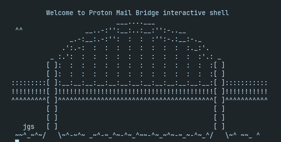

<!--
Важно: этот README был автоматически сгенерирован <https://github.com/YunoHost/apps/tree/master/tools/readme_generator>
Он НЕ ДОЛЖЕН редактироваться вручную.
-->

# ProtonMail Bridge для YunoHost

[](https://ci-apps.yunohost.org/ci/apps/protonmail-bridge/)  

[](https://install-app.yunohost.org/?app=protonmail-bridge)

*[Прочтите этот README на других языках.](./ALL_README.md)*

> *Этот пакет позволяет Вам установить ProtonMail Bridge быстро и просто на YunoHost-сервер.*  
> *Если у Вас нет YunoHost, пожалуйста, посмотрите [инструкцию](https://yunohost.org/install), чтобы узнать, как установить его.*

## Обзор

Use Proton Mail with your email client.


**Поставляемая версия:** 3.12.0~ynh1

## Снимки экрана



## Документация и ресурсы

- Официальный веб-сайт приложения: <https://proton.me/mail/bridge>
- Официальная документация пользователя: <https://proton.me/support/protonmail-bridge-install>
- Официальная документация администратора: <https://proton.me/support/protonmail-bridge-install>
- Репозиторий кода главной ветки приложения: <https://github.com/ProtonMail/proton-bridge>
- Магазин YunoHost: <https://apps.yunohost.org/app/protonmail-bridge>
- Сообщите об ошибке: <https://github.com/YunoHost-Apps/protonmail-bridge_ynh/issues>

## Информация для разработчиков

Пришлите Ваш запрос на слияние в [ветку `testing`](https://github.com/YunoHost-Apps/protonmail-bridge_ynh/tree/testing).

Чтобы попробовать ветку `testing`, пожалуйста, сделайте что-то вроде этого:

```bash
sudo yunohost app install https://github.com/YunoHost-Apps/protonmail-bridge_ynh/tree/testing --debug
или
sudo yunohost app upgrade protonmail-bridge -u https://github.com/YunoHost-Apps/protonmail-bridge_ynh/tree/testing --debug
```

**Больше информации о пакетировании приложений:** <https://yunohost.org/packaging_apps>
